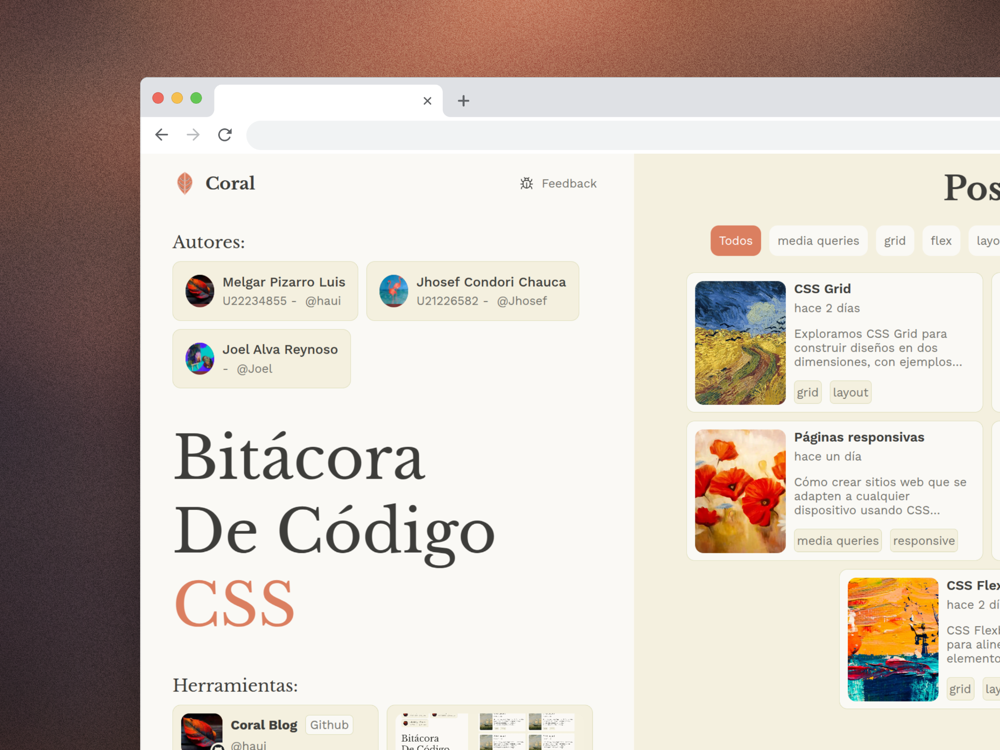
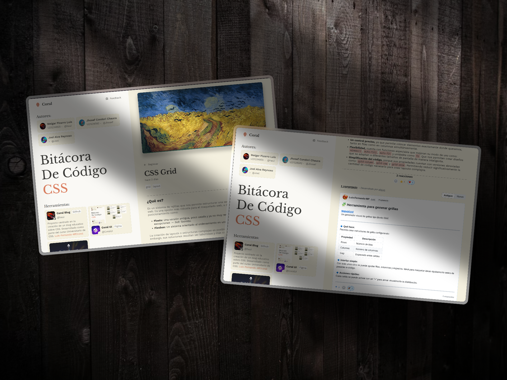

### Enlaces del Proyecto

[](https://github.com/Luis-Fernando-MP/coral)
[](https://www.figma.com/proto/bBWwb01V0ph2XSHCxtJJi7/Blog-css?node-id=1-2&t=gxCLvPs1zQQwKEhK-1&scaling=scale-down&content-scaling=fixed&page-id=0%3A1)
[](https://coral-blog.vercel.app)

---

# CORAL - Bitácora de Código CSS

## 🎯 **Sobre el Proyecto**

**CORAL** es un blog enfocado en CSS. Este proyecto fue desarrollado como parte del curso Universitario de CSS, con el objetivo de compartir conocimientos y experiencias en el mundo del diseño web.

## 📸 Vista Previa

<div style="column-count: 1; margin: 20px 0;">
   
   
</div>

## 🛠️ Tecnologías Utilizadas

[](https://astro.build)
[](https://vercel.com)
[](https://figma.com)
[](https://www.typescriptlang.org)
[](https://mermaid-js.github.io)
[](https://giscus.app)
[](https://day.js.org)
[](https://lucide.dev)
[](https://sass-lang.com)

## 👥 Equipo de Desarrollo

- **Melgar Pizarro Luis** - U22234855 - [@haui](https://github.com/Luis-Fernando-MP)
- **Jhosef Condori Chauca** - U21226582
- **Joel Alva Reynoso**

## 🚀 Guía de Instalación y Ejecución

Pasos para instalar y ejecutar el proyecto en tu máquina local:

1. Clona el repositorio:

   ```sh
   git clone https://github.com/Luis-Fernando-MP/coral.git
   cd coral
   ```

2. Instala las dependencias:

   ```sh
   pnpm install
   ```

3. Inicia el servidor de desarrollo:

   ```sh
   pnpm dev
   ```

4. Accede al proyecto en tu navegador en `http://localhost:4321`.

## 📁 Estructura del Proyecto

```text
├── public/
│   ├── authors/
│   └── assets/
├── content/
│   └── blog/
├── src/
│   ├── components/
│   ├── layouts/
│   ├── lib/
│   ├── pages/
│   └── sass/
├── astro.config.mjs
├── README.md
├── package.json
└── tsconfig.json
```

- **`public/`**: Archivos estáticos
- **`content/`**: Posts del blog
- **`src/components/`**: Componentes reutilizables.
- **`src/layouts/`**: Plantillas de diseño
- **`src/lib/`**: Funciones y utilidades
- **`src/pages/`**: Páginas del sitio
- **`src/sass/`**: Estilos de la aplicación

### ¡Gracias por tu interés en Coral!
