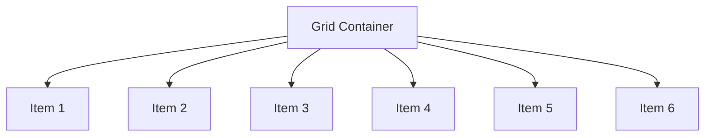

# CSS Grid

CSS Grid es un sistema de diseño bidimensional que facilita la creación de layouts complejos en la web. Permite distribuir elementos en filas y columnas, adaptándose a diferentes tamaños de pantalla de manera sencilla y eficiente.

## ¿Qué es CSS Grid?

CSS Grid Layout, o simplemente Grid, es una especificación de CSS que nos permite crear estructuras de diseño avanzadas sin necesidad de usar floats o posicionamiento absoluto. Grid es ideal para construir layouts de páginas completas o secciones específicas que requieran alineación tanto horizontal como vertical.

## Ventajas de CSS Grid

| Ventaja        | Descripción                                                   |
| -------------- | ------------------------------------------------------------- |
| Bidimensional  | Permite trabajar en filas y columnas simultáneamente          |
| Responsive     | Facilita la adaptación a diferentes dispositivos              |
| Sencillez      | Reduce la cantidad de código necesario para layouts complejos |
| Control total  | Permite alinear, distribuir y ordenar elementos fácilmente    |
| Compatibilidad | Soportado por todos los navegadores modernos                  |

## Sintaxis Básica

Para empezar a usar Grid, solo necesitas definir el contenedor como `display: grid` y luego establecer las filas y columnas:

```css
.container {
	display: grid;
	grid-template-columns: 1fr 2fr 1fr;
	grid-template-rows: auto 200px;
	gap: 16px;
}
```

```html
<div class="container">
	<div>Elemento 1</div>
	<div>Elemento 2</div>
	<div>Elemento 3</div>
	<div>Elemento 4</div>
	<div>Elemento 5</div>
	<div>Elemento 6</div>
</div>
```

## Propiedades Principales

| Propiedad               | Ejemplo                           | Descripción                                |
| ----------------------- | --------------------------------- | ------------------------------------------ |
| `display: grid`         | `display: grid;`                  | Activa el modo grid en el contenedor       |
| `grid-template-columns` | `grid-template-columns: 1fr 2fr;` | Define el número y tamaño de columnas      |
| `grid-template-rows`    | `grid-template-rows: 100px auto;` | Define el número y tamaño de filas         |
| `gap`                   | `gap: 10px;`                      | Espacio entre filas y columnas             |
| `grid-column`           | `grid-column: 1 / 3;`             | Hace que un elemento ocupe varias columnas |
| `grid-row`              | `grid-row: 2 / 4;`                | Hace que un elemento ocupe varias filas    |

## Ejemplo Práctico

```css
.grid-ejemplo {
	display: grid;
	grid-template-columns: repeat(3, 1fr);
	grid-template-rows: 100px 100px;
	gap: 10px;
}
.grid-ejemplo div {
	background: #e0e7ef;
	border: 1px solid #b0b8c1;
	display: flex;
	align-items: center;
	justify-content: center;
	font-weight: bold;
}
```

```html
<div class="grid-ejemplo">
	<div>1</div>
	<div>2</div>
	<div>3</div>
	<div>4</div>
	<div>5</div>
	<div>6</div>
</div>
```

## Visualización de Grid con Mermaid

Puedes visualizar la estructura de un grid usando Mermaid:



O una representación de filas y columnas:

```mermaid
flowchart TB
    subgraph Row 1
        A1[1] --- A2[2] --- A3[3]
    end
    subgraph Row 2
        B1[4] --- B2[5] --- B3[6]
    end
    Row 1 --> Row 2
```

## Comparación: Grid vs Flexbox

| Característica     | CSS Grid                         | Flexbox                         |
| ------------------ | -------------------------------- | ------------------------------- |
| Eje principal      | Bidimensional (filas y columnas) | Unidimensional (fila o columna) |
| Layouts complejos  | Muy sencillo                     | Más complicado                  |
| Orden de elementos | Fácil de reordenar               | Fácil de reordenar              |
| Casos de uso       | Layouts completos                | Componentes individuales        |

## Recursos adicionales

- [Guía oficial de CSS Grid (MDN)](https://developer.mozilla.org/es/docs/Web/CSS/CSS_Grid_Layout)
- [CSS Tricks: A Complete Guide to Grid](https://css-tricks.com/snippets/css/complete-guide-grid/)

¡Explora CSS Grid y lleva tus diseños web al siguiente nivel!
