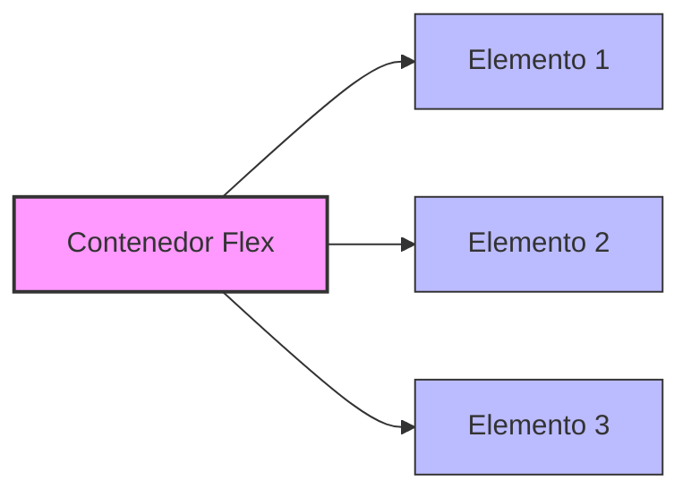

# Flexbox en CSS: Guía Completa

Flexbox es un módulo de diseño en CSS que facilita la creación de layouts flexibles y eficientes, alineando y distribuyendo espacio entre los elementos de un contenedor, incluso cuando su tamaño es desconocido o dinámico.

## ¿Qué es Flexbox?

Flexbox, o el Modelo de Caja Flexible, permite diseñar interfaces complejas de manera sencilla. Su principal ventaja es la capacidad de distribuir el espacio y alinear los elementos de forma predecible.

## Propiedades principales

| Propiedad         | Descripción                                           | Valores principales                     |
| ----------------- | ----------------------------------------------------- | --------------------------------------- |
| `display`         | Activa el contexto flexbox                            | `flex`, `inline-flex`                   |
| `flex-direction`  | Dirección de los elementos hijos                      | `row`, `row-reverse`, `column`          |
| `justify-content` | Alinea los elementos en el eje principal              | `flex-start`, `center`, `space-between` |
| `align-items`     | Alinea los elementos en el eje cruzado                | `stretch`, `center`, `flex-end`         |
| `flex-wrap`       | Permite que los elementos se ajusten en varias líneas | `nowrap`, `wrap`, `wrap-reverse`        |

## Ejemplo básico de Flexbox

```css
.container {
	display: flex;
	flex-direction: row;
	justify-content: space-between;
	align-items: center;
}
.item {
	background: #4caf50;
	color: white;
	padding: 20px;
	margin: 5px;
}
```

```html
<div class="container">
	<div class="item">Elemento 1</div>
	<div class="item">Elemento 2</div>
	<div class="item">Elemento 3</div>
</div>
```

## Diagrama de Flexbox con Mermaid



## Ejemplo avanzado: Menú de navegación responsivo

```css
.nav {
	display: flex;
	flex-wrap: wrap;
	justify-content: center;
	background: #222;
}
.nav-item {
	color: #fff;
	padding: 15px 25px;
	text-decoration: none;
}
```

```html
<nav class="nav">
	<a class="nav-item" href="#">Inicio</a>
	<a class="nav-item" href="#">Blog</a>
	<a class="nav-item" href="#">Contacto</a>
</nav>
```

## Ventajas de Flexbox

- Fácil alineación vertical y horizontal.
- Distribución automática del espacio.
- Adaptabilidad a diferentes tamaños de pantalla.

## Comparación: Flexbox vs Grid

| Característica       | Flexbox                     | Grid                    |
| -------------------- | --------------------------- | ----------------------- |
| Eje principal        | Uno (horizontal o vertical) | Dos (filas y columnas)  |
| Mejor para           | Layouts lineales            | Layouts bidimensionales |
| Soporte de navegador | Excelente                   | Excelente               |

## Conclusión

Flexbox es una herramienta poderosa para crear layouts modernos y responsivos en CSS. Su sintaxis sencilla y su flexibilidad lo convierten en una opción ideal para la mayoría de los proyectos web.
