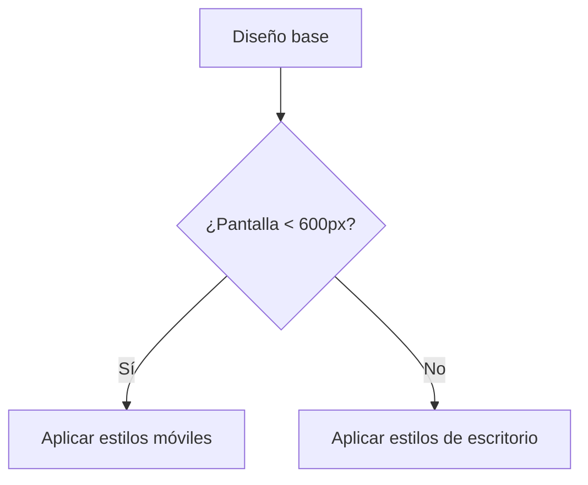
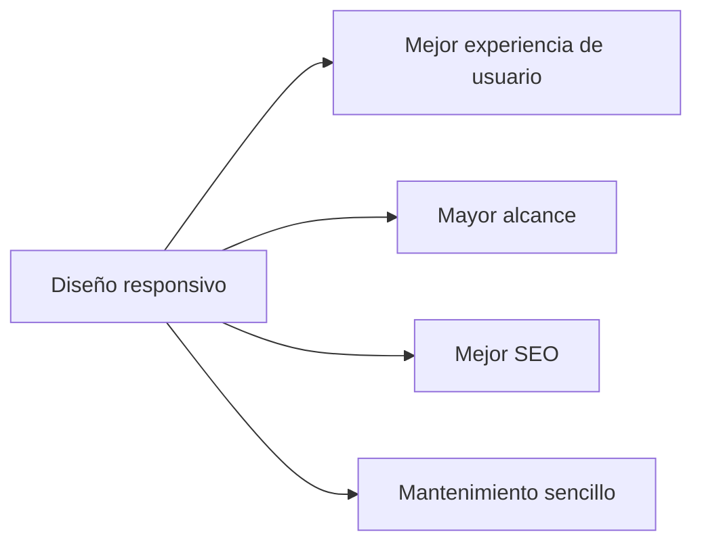

# Sise Responsivo con CSS

El diseño responsivo es una técnica fundamental en el desarrollo web moderno. Permite que los sitios web se adapten a diferentes tamaños de pantalla y dispositivos, mejorando la experiencia del usuario.

## ¿Qué es el diseño responsivo?

El diseño responsivo consiste en crear páginas web que se vean bien en cualquier dispositivo, ya sea un teléfono móvil, una tableta o una computadora de escritorio. Esto se logra utilizando CSS para ajustar el diseño según el tamaño de la pantalla.

```css
/* Ejemplo básico de media queries */
.container {
	width: 80%;
	margin: auto;
}

@media (max-width: 600px) {
	.container {
		width: 100%;
		padding: 10px;
	}
}
```

En el ejemplo anterior, `.container` ocupa el 80% del ancho en pantallas grandes, pero en dispositivos con un ancho menor a 600px, ocupa el 100% y agrega un poco de padding.

## Ventajas del diseño responsivo

- Mejor experiencia de usuario
- Mayor alcance de audiencia
- Mejor posicionamiento SEO
- Mantenimiento más sencillo

## Ejemplo práctico

Supongamos que queremos crear una galería de imágenes que se adapte a diferentes dispositivos:

```html
<div class="gallery">
	
	
	
</div>
```

```css
.gallery {
	display: flex;
	gap: 10px;
}

.gallery img {
	width: 100%;
	max-width: 200px;
	border-radius: 8px;
}

@media (max-width: 600px) {
	.gallery {
		flex-direction: column;
		align-items: center;
	}
}
```

En pantallas grandes, las imágenes se muestran en fila. En pantallas pequeñas, se apilan verticalmente.

## Gráfica: Flujo de diseño responsivo



## Gráfica: Ventajas del diseño responsivo



## Conclusión

El diseño responsivo con CSS es esencial para crear sitios web modernos y accesibles. Utilizando media queries y buenas prácticas, puedes asegurarte de que tu sitio se vea y funcione bien en cualquier dispositivo.
